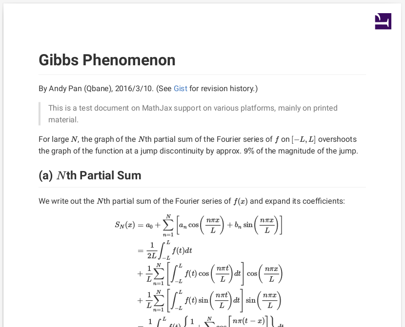

# (Experiment) MathJax in PDF



Try to render MathJax in pure HTML/CSS for use in environments without JS.

This experiment is part of [my project](https://paper.dropbox.com/doc/Markdown-to-PDF-xTMXMPHv0dM3rQDIJERgf) at [NTUOSC](https://ntuosc.org/), trying to write and publish documents of simple structure in Markdown and PDF formats. One of the features is the support of LaTeX math expressions, especially for people (including myself) who are going to use this tool to write some technical reports.

I decided to use [MathJax](http://www.mathjax.org) for LaTeX support. (No, no, MathML cannot satisfy me!) Since MathJax tends to be typeset by heavy JS at client-side, I wondered if there is an option to render it within Node.js, piping out the HTML/CSS structure to [PrinceXML](http://princexml.com/). To my suprise, there is an undocumented hiding [here](https://github.com/mathjax/MathJax-node).

Sample document used in this experiment, which was written half a year ago, containing LaTeX markers for both display style and inline math, can be accessed at https://gist.github.com/andy0130tw/361531904c6909da8b86.

# To Test

The document `doc.md` is converted to HTML by [Markdown-it](https://markdown-it.github.io/) using [a plugin](https://github.com/classeur/markdown-it-mathjax) to escape math expressions.

```sh
npm install                  # install dependencies
node index.js                # produce output.html
prince output.html test.pdf  # produce test.pdf
```

# Known Issues (as for now) / To-dos

  * Super-slow in both convertions, MathJax and PrinceXML.
  * Output format: HTML-CSS is preferable, but failed with a timeout. Use CommonHTML instead.
  * Should provide customizable font paths.
  * More verbose on progress.
  * Some typesetting issues like the fraction bar (?). MathJax is intended to be run in browser because [it need context to apply workarounds](https://groups.google.com/forum/#!msg/mathjax-users/O--eKm9elRU/zNZx24gnI3gJ). Will try to adjust or patch settings accordingly to the result of Prince.
